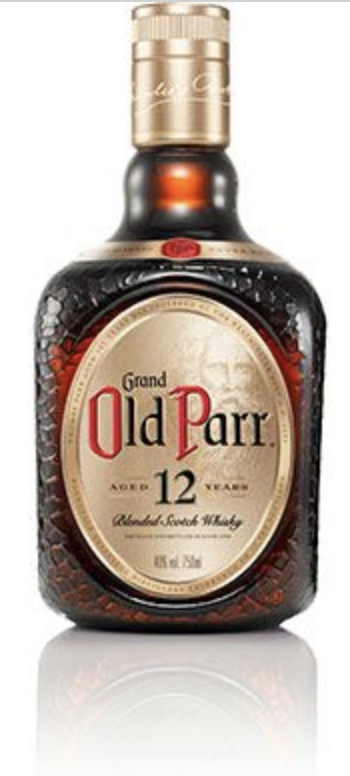

Theme: Business Class
text: Roboto, #53585F
text-strong: Roboto Bold, #EE783F
text-emphasis: Roboto Light Italic
header: Roboto, #53585F
header-strong: Roboto Strong,#EE783F
header-emphasis: Reklame Script, #53585F
code: Fira Code Medium, #EE783F, #8B3D90, #2E59A2, #DF393F, #1EA8D9
background-color: #FFFFFF
table-separator: #DDDEE0
footer: **#z_snack** **|** 2021-07-02
slidenumbers: true

# **水割りを味わおう**  

#### スナック箕輪 2021-07-02

[.slidenumbers: false]

---
# **飲んでますか？** 🍻   
[.slidenumbers: false]

---
# **ウィスキーと割り物**
[.slidenumbers: false]

- 雑に理解するならこれで

| 飲み方 | 割り物 | 期待効果 |
| --- | --- | --- |
| ストレート | - | ウィスキー本来の香りと味を楽しみたい |
| ロック | 氷 | ヒエヒエ感を際立たせたい |
| 水割り  twice up | ウィスキーと同量の水 | 香りを際立たせて味わいたい |
| 水割り | 大体 1 : 2〜2.5くらい | じっくり味わいたい |
| ソーダ割り a.k.a. ハイボール | 1 : 3〜4 くらい | 爽快感を出したい・癖のあるものの花を開かせたい |
| お湯割り | お湯 | 暖を取りたい・香りを一気に引き出したい |

---
# **本日の一本**
## オールド・パー12年
[.slidenumbers: false]

---
# **3行ウンチク**
+ 明治時代に日本に輸入された（岩倉使節団が持ち帰った）
+ トーマス・パーという人が152歳まで生きた、という逸話にちなんでいる
+ ブレンデッドウイスキーの定番のひとつ

[.slidenumbers: false]

---
# **Enjoy!**
[.slidenumbers: false]

