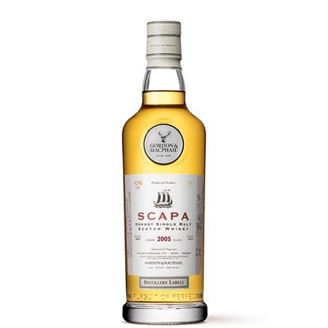

Theme: Business Class
text: Roboto, #53585F
text-strong: Roboto Bold, #EE783F
text-emphasis: Roboto Light Italic
header: Roboto, #53585F
header-strong: Roboto Strong,#EE783F
header-emphasis: Reklame Script, #53585F
code: Fira Code Medium, #EE783F, #8B3D90, #2E59A2, #DF393F, #1EA8D9
background-color: #FFFFFF
table-separator: #DDDEE0
footer: **#z_snack** **|** 2021-07-02
slidenumbers: true

# **ブレンデッド原酒を味わおう**  

#### スナック箕輪 2021-07-09

[.slidenumbers: false]

---
# **今日も元気にパイカンです** 🍻   
[.slidenumbers: false]

---
# **本日のトピック**
- ウイスキーのスタイル
- オフィシャルボトルとボトラーズ

[.slidenumbers: false]

---
# **ウイスキーのスタイル - overview -**

- モルトウイスキー
- グレーンウイスキー
- ブレンデッドウイスキー

[.slidenumbers: false]

---
# **ウイスキーのスタイル - モルトウイスキー -**

- 大麦麦芽のみを使用

[.slidenumbers: false]

---
# **ウイスキーのスタイル - グレーンウイスキー -**

- 大麦以外の穀物を使用
  - 割合などでコーンウイスキー、ライウイスキーなどが決まる

[.slidenumbers: false]

---
# **ウイスキーのスタイル - ブレンデッドウイスキー -**

- 1種類以上のモルトウイスキーと1種類以上のグレーンウイスキーを混ぜたもの

[.slidenumbers: false]

---
# **ウイスキーのスタイル - モルトウイスキー -**
- シングルモルトウイスキー => ひとつの蒸留所で製造したモルトを利用
- ブレンデッドモルトウイスキー => 複数の蒸留所で製造したモルトを混ぜたもの

[.slidenumbers: false]

---
# **オフィシャルボトルとボトラーズ(1)**
- オフィシャル = 蒸留所
- ボトラーズ = 瓶詰め業者

[.slidenumbers: false]

---
# **オフィシャルボトルとボトラーズ(2)**
- ボトラーズは樽を買い付けて独自の熟成やブレンドを行って価値を高める

[.slidenumbers: false]

---
# **本日の一本**
## ゴードン＆マクファイル スキャパ2005 蒸留所ラベル 

[.slidenumbers: false]

---
# **3行ウンチク**
+ バランタインのキーモルトのひとつ
+ ゴードン＆マクファイルは著名なボトラーズのひとつ
+ 蒸留所ラベルというのは蒸留所公認なのでちょっと鼻が高い

[.slidenumbers: false]

---
# **Enjoy!**
[.slidenumbers: false]

