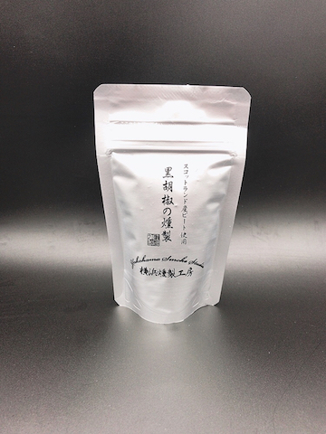

Theme: Business Class
text: Roboto, #53585F
text-strong: Roboto Bold, #EE783F
text-emphasis: Roboto Light Italic
header: Roboto, #53585F
header-strong: Roboto Strong,#EE783F
header-emphasis: Reklame Script, #53585F
code: Fira Code Medium, #EE783F, #8B3D90, #2E59A2, #DF393F, #1EA8D9
background-color: #FFFFFF
table-separator: #DDDEE0
footer: **#z_snack** **|** 2021-07-16
slidenumbers: false

# **暑さを吹き飛ばす炭酸祭 ハイボール7種飲み比べ**  

#### スナック箕輪 2021-07-16

---
# **梅雨明けだ！** 🍻   

---
# **本日のお品書き**

・ブラックニッカ ディープブレンド
・角
・ホワイトホース ファインオールド
・ジョニーウォーカー ブラックレーベル12年
・グレンモーレンジィ オリジナル
・タリスカー 10年
・ラフロイグ クオーターカスク

---
# **雑分類**
・ブラックニッカ〜ジョニ黒 => 好きに飲め！
・グレンモーレンジィ => フルーティ感欲しい人向け
・タリスカー => クセ強め、塩っけ感じつつグイグイいきたい人向け
・ラフロイグ => クセもっと強め、炭酸で割ると味わいやすくなる

---
# **飲み会サバイバルガイド**

・飲む前に炭水化物を入れておきましょう
・アルコール1に対して水分を2〜3とっておけると安心です。
・飲み比べなので、リセットするために次のを飲む前に少し水入れてゆすぐ感じにするとよさそう
・翌日も炭水化物と水分を少し多めに。生のきゅうりとかカリウム豊富なやつでむくみ解消もGood

---
# **今日の裏ゲスト**

## **黒胡椒の燻製 by 横浜燻製工房**

---
# **黒胡椒とハイボール**

・フィニッシュに黒胡椒をひとふりすると、後味がしまります
・タリスカーが「スパイシーハイボール」としてこの飲み方を提案
・横浜燻製工房の黒胡椒はピートがきいているのでこの辺との相性バッチリ

---
# **梅雨明けEnjoy！** 🍻   

